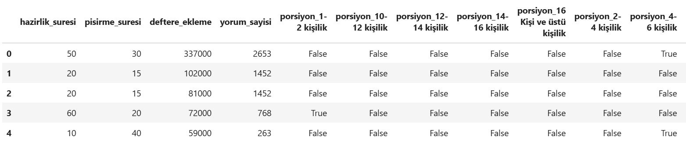

# Yemek Tariflerinin Popülerlik Tahmin Modeli

Bu proje, kapsamında yemek tarifleri içeren bir web sitesinden veri kazıma yapıldı.Yemeklere ait hazırlık süresi,pişirme süresi,
porsiyon bilgileri,kullanıcıların tarif defterlerine ekleme sayıları ve yorum sayıları bilgileri alınıdı ve dosyaya yazdırıldı.
Yemek tariflerinin verileri kullanılarak, çeşitli makine öğrenmesi modelleri geliştirildi.
Modellerin amacı, yemek tariflerinin hazırlık süresi ,porsiyonu ,yorum sayısı bilgileri kullanılarak deftere eklenme miktarını tahmin etmektir.

### **Kullanılan Program**  
Proje, **Jupyter Notebook** programı kullanılarak gerçekleştirilmiştir.

## Proje İçeriği

Bu projede aşağıdaki adımlar gerçekleştirilmiştir:

### 1. **Veri Ön İşleme (Data Preprocessing)**  
- CSV dosyasındaki veriler bir DataFrame olarak içe aktarıldı ve incelendi.  
- Kategorik veriler **One-Hot Encoding** ile dönüştürüldü.  
- Zaman bilgileri dakikaya çevrildi.  
- Yazı ile yazılan bazı sayı değerleri (örneğin: bin gibi) düzeltildi.  
- Eksik değerler işlendi.  

### 2. **Veri Görselleştirme**  
- Sayısal sütunlar için **histogramlar** çizildi.  
- Kategorik sütunlar için **pasta grafikleri** oluşturuldu.  
- Korelasyon matrisleri kullanılarak veriler arasındaki ilişkiler incelendi.  

### 3. **Aykırı Değerlerin Düzeltilmesi**  
- **IQR (Interquartile Range)** yöntemiyle aykırı değerler tespit edilip, bu değerler ortalama ile dolduruldu.  

### 4. **Modelleme**  
- **Random Forest**, **Gradient Boosting** ve **XGBoost** gibi regresyon modelleri kullanılarak tahminler yapıldı.  
- Hedef değişken **Label Encoding** kullanılarak kategorik hale dönüştürüldü.  
- Sınıflandırma için **SVM (Support Vector Machine)** ve **KNN (K-Nearest Neighbors)** algoritmaları uygulandı.  
- **GridSearchCV** kullanılarak SVM ve KNN modellerinin hiperparametreleri optimize edildi.  
**GridSearchCV** (Grid Search Cross Validation), belirtilen parametrelerin farklı kombinasyonlarını dener ve her bir kombinasyon için çapraz doğrulama yaparak en iyi performansı veren parametre setini seçer.  

### 5. **Sonuçlar**  
- Eğitim ve test setlerine ayırdıktan sonra modeller eğitildi.  
- Regresyon modelleri, **R² skoru** ve **Mean Squared Error (MSE)** gibi performans metrikleri hesaplanarak değerlendirildi.  
- Sınıflandırma modellerini değerlendirmek için ise **sınıflandırma raporu (Classification Report)**,**karmaşıklık matrisi(Confusion Matrix)** ve **doğruluk (Accuracy)** metrikleri kullanıldı.
## Kullanılan Kütüphaneler
Bu kütüphaneler, proje kapsamında veri analizi, görselleştirme, model oluşturma ve değerlendirme süreçlerini desteklemek için tercih edilmiştir.
 
- **`pandas`**: Veri analizi ve manipülasyonu için kullanılmıştır.  
- **`numpy`**: Sayısal hesaplamalar ve veri işlemleri için kullanılmıştır.  
- **`seaborn` ve `matplotlib.pyplot`**: Veri görselleştirme işlemleri için kullanılmıştır.  
- **`sklearn.model_selection`**: Veri setini eğitim ve test olarak ayırmak için kullanılmıştır.  
- **`sklearn.ensemble`**: Random Forest modeli oluşturmak ve eğitmek için kullanılmıştır.  
- **`sklearn.tree`**: Decision Tree modeli oluşturmak ve eğitmek için kullanılmıştır.  
- **`sklearn.linear_model`**: Logistic Regression modeli oluşturmak ve eğitmek için kullanılmıştır.  
- **`sklearn.metrics`**: Model performansını ölçmek için metrikler (accuracy, recall, precision, F1 score, confusion matrix) sağlamak amacıyla kullanılmıştır.  

## Veri Seti

Veri seti, yemek tariflerinin çeşitli özelliklerini içeren bir CSV dosyasından alınmıştır. Dosya yapısı aşağıdaki sütunlara sahiptir:

- `porsiyon`: Porsiyon sayısı (kategorik)
- `hazirlik_suresi`: Hazırlık süresi (saat ve dakika cinsinden)
- `pisirme_suresi`: Pişirme süresi (saat ve dakika cinsinden)
- `deftere_ekleme`: Yemek tarifinin deftere eklenme miktarı (sayısal)
- `yorum_sayisi`: Yemek tarifine yapılan yorum sayısı(sayısal)

## Regresyon Modelleri

### Random Forest

Random Forest, karar ağaçları kullanan bir ansamble yöntemidir ve yemek tariflerinin deftere eklenme miktarını tahmin etmek için kullanılmaktadır.

### Gradient Boosting

Gradient Boosting, zayıf verilerin toplandığı güçlü bir tahmin modelidir. Bu model de yemek tariflerinin deftere eklenme miktarını 
tahmin etmek için kullanılmıştır.

### XGBoost

XGBoost, optimizasyon ve hız açısından güçlü bir modeldir ve büyük veri setlerinde genellikle yüksek performans sergiler.
## Sınıflandırma Modelleri

### Support Vector Machine (SVM)  
SVM, sınıflandırma ve regresyon analizlerinde kullanılan güçlü bir makine öğrenmesi modelidir. Verisetindeki örnekleri doğru sınıflara ayırmak için en iyi hiper düzlemi (decision boundary) bulmaya çalışır. SVM, özellikle yüksek boyutlu verilerde ve karmaşık sınıflandırma problemlerinde etkili sonuçlar verir.

### K-Nearest Neighbors (KNN): 
KNN, basit ve sezgisel bir sınıflandırma algoritmasıdır. Yeni bir örnek, eğitim verisindeki en yakın K komşusuna göre sınıflandırılır. KNN, etiketli verilerin yoğun olduğu ve önceden model eğitimi gerektirmeyen durumlarda yaygın olarak kullanılır.

## Proje Görselleri

### 1. Veri Setinin Orijinali

### 2. Temizlenmiş Veri Seti

### 3. Sayısal Sütunların Histogramları

### 4. Kategorik Sütunların Pasta Grafiği

### 5. Korelasyon Matrisi

### 6. Regresyon Modelleri Sonuçları

### 7. Sınıflandırma Modelleri Sonuçları

## Video Açıklaması

Proje hakkında daha fazla bilgi ve açıklamalar için aşağıdaki videoyu izleyebilirsiniz:

[Proje Açıklama Videosu](https://youtu.be/WG8RXuxuVGE)

## Yazar

- **ÜMMÜ GÜLSÜN DEMİRCİ**

## Katkıda Bulunma

1. Bu projeye katkıda bulunmak isterseniz, lütfen `pull request` gönderin.
2. Sorunları ve önerileri `issues` sekmesinden bildirebilirsiniz.

---

